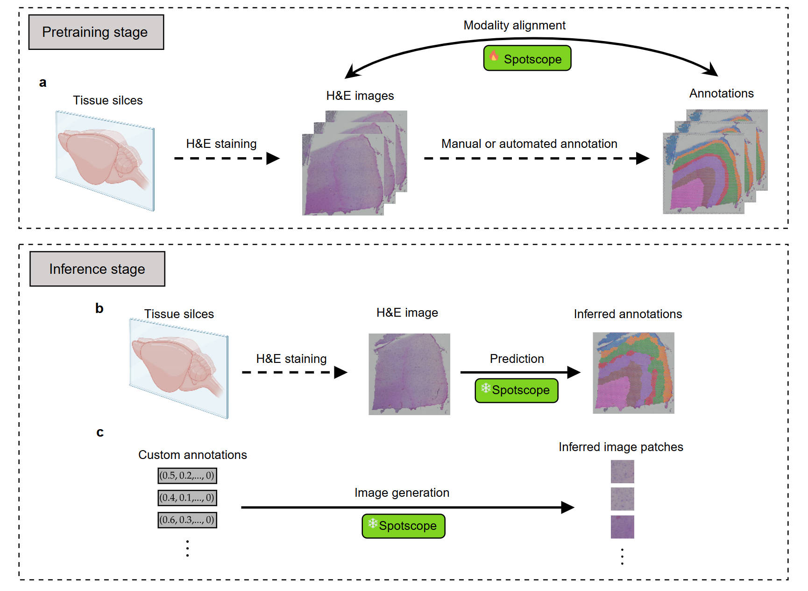

Spotscope
=============================================

An efficient tool for Enabling Bidirectional Querying of H\&E Images and Annotation Information

Spatial transcriptomics technologies allow researchers to enrich the annotation of H\&E images by integrating transcriptomics information. However, these annotations often come with high costs and low resolution. To address this issue, we propose a deep learning framework based on contrastive spot-image pretraining to enable efficient bidirectional querying between H\&E images and annotation information, named Spotscope. Spotscope not only performs super-resolution spot annotation directly from H\&E images but also generates corresponding histological images based on annotation information. We conducted experiments on four tasks: deconvolution, gene expression level prediction, tissue domain identification, and tumor region recognition. Compared to other methods, Spotscope achieves more accurate and detailed spot annotation, such as identifying heterogeneity within breast cancer tumors. Additionally, Spotscope can generate intermediate histological image patches based on customized annotations, such as transitions from normal tissue to cancerous tissue. 

.. note::

   This project is under active development.

 
Spotscope Manuscript
------------------

coming soon...

Spotscope Installation & Usage
------------------

.. toctree::
   :maxdepth: 2

   installation 
   usage

Spotscope Tutorials
------------------

.. toctree::
   :maxdepth: 2

   notebooks/1MOB_infer_celltype
   notebooks/2MOB_infer_marker
   notebooks/3MOB_from_image
   notebooks/4DLPFC_infer

